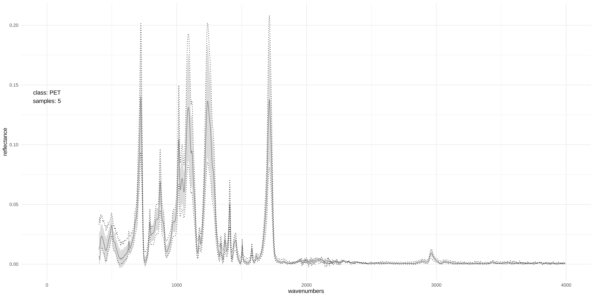

## Welcome to my research website!  

Here I present the results of my work for a master's seminar at the University of Marburg concerned with microplastic in the environment.  
 
 
*Photo of two sediment separators taken by Sarah Brüning*

The seminar was placed in the context of a [research project](https://www.uni-marburg.de/administration/verwaltung/stab/umr2027/aktuelleprojekte/gefoerdertes/mikroplastik) between the working group of Soil and Water Ecosystems at the Institute of Geography and the working group of Semiconductor Photonics at the Institute of Physics. It was conducted jointly by [Prof. Dr. Peter Chifflard](https://www.uni-marburg.de/de/fb19/fachbereich/staff/prof-dr-peter-chifflard) and [MSc Julia Prume](https://www.uni-marburg.de/de/fb13/halbleiterphotonik/team) and was focused on the analysis of envrionmental samples to answer different geographical questions about the how and then of microplastic particles moving in water ecosystems.  
While the most projects during the seminar were focusing on these important geographical questions I set out my project to actually ease the cumbersome process of categorizing FTIR spectra of particles wihtin the samples to polymer classes. The idea was that up-to-date machine learning models applied to the high-dimensional spectral data of particles found in samples could minimize the need for human intervention in the classifcation process and thus significantly speed up the process of categorizing particles to reference polymers.  

To achieve this aim this project consisted of basically four distinguishable work steps. These are:    

* **Preparation**: At first the establishment of a comprehensive database of reference spectra was mandatory to allow the application of machine learning models. The preparation steps included spectral resampling and labeling of reference polymers and natural particles. Later, this database underwent some steps of baseline corrections as well as different level of pre-processing such as normalisation and Savtizkiy-Golay filtering.  
* **Exploration**: At the different types of pre-processing techniques were assessed by a brute-force method in which all different levels of the data were presented to different machine learning models and their capability to correctly classify the dataset was captured. Additionally, different levels of noise was added to the data so that the models and pre-processing types which most robustly classify the spectra could be identified.  
* **Calibration**: After the explorative stage, a applicable algorithm which can be calibrated to a potentially changing database needed to be established. That was important, so that the code can be used in the future as well e.g. when the reference database should be extended or the wavenumbers of interes might change.  
* **Classification**: This last stage is the core part of the project in the sense that at this stage real environmental samples are to be classified in a user-friendly way to ease the categorization process. That means that some accuracy values of the classification need to be easily accesiable as well as some possibilities for a human agent to assess the accuracy 

  
*Average spectrum of PET samples in the database* 
