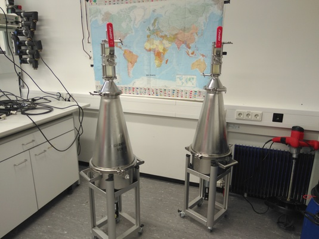

```{r setup, include=FALSE, warning=FALSE, message=FALSE}
source("code/setup.R")
source("code/functions.R")
library(plotly)
data = read.csv("ref/reference_database.csv",header=TRUE)
wvn = readRDS("ref/wavenumbers.rds")
```


## Welcome to my website on polymeRID!  


Here I present the results of my work for a master's seminar at the 
University of Marburg concerned with microplastic in the environment.  
<br>
<br>
*Photo of two sediment separators taken by Sarah Brüning*

Microplastic particles polluting the environment have been in the public focuse
for some time now. The scientific efforts of analysing the occurences
of particles in the envrionment and their effects on ecosystems and human health
is manifold, yet there is a lack of consensus on methods for sampling, sample handling,
analysis and identification, especially for samples from aquatic ecosystems.
Some of the most urgent research questions concerned with microplastic in the envrionment
are the analysis of effects on biological lifeforms [@Zhang2019], their movement and
distribution in the marine environment [@Auta2017] as well as in freshwater systems [@Li2018b].

Different research questions demand for different methodologies for sampling,
sample handling and labroratory analysis. However, the link between these 
knowledge gaps is that any analysis of microplastics in the environment needs a 
robust identification method to enable scientist to draw the right conclusions 
and to bring forward recommendations to the public and decision makers to act upon
their research findings.

Evidently, there also exist a broad spectrum of different polymer identification
strategies [@Loder2015;@Rocha-Santos2015a;@Shim2017], ranging from traditional microscopy 
to spectroscopy as well as destructive methods of thermal analysis. A distinction
has to be made concerning towards the extent of automation in identification
processes. Lately, different approaches to automate in the identification process,
either by individual elements or for whole samples on a focal plane, have reported 
to the scientific community [@Masoumi2012;@Primpke2017;@Lorenzo-Navarro2018;@Zhang2018;@Primpke2019]

This project sets out to contribute to the ease of the cumbersome process of 
classifying individual particles based on their spectral reflectance by hand.
The idea is that up-to-date machine learning models applied to the 
high-dimensional spectral data of particles found in environmental samples can 
minimize the need for human intervention in the classification process and 
thus significantly speed up the process of categorizing found particles.
Other studies have reported substantial accuracies by applying different sorts
of machine learning algorithms such as hierarchical clustering [@Primpke2017], 
support-vector-machines [@bianco2019], random forest [@Hufnagl2019], as well as
convolutional neural networks [@Liu2017] to classify micro plastics and other materials spectra.

This project was grouped into different working steps, which also were designed
to allow reproducibility as well individual alteration of the code and data base. 
These working steps are:    

* **Preparation**: At first the establishment of a comprehensive database of reference spectra was mandatory to allow the application of machine learning models. The preparation steps included spectral re-sampling and labeling of reference polymers and natural particles. Later, this database underwent some steps of baseline corrections as well as different level of pre-processing such as normalization and Savtizkiy-Golay filtering.  

* **Exploration**: At the different types of pre-processing techniques were assessed by a brute-force method in which all different levels of the data were presented to different machine learning models and their capability to correctly classify the data-set was captured. Additionally, different levels of noise was added to the data so that the models and pre-processing types which most robustly classify the spectra could be identified. 

* **Calibration**: After the exploration stage, a applicable algorithm which can be calibrated to a potentially changing database needed to be established. That was important, so that the code can be used in the future as well e.g. when the reference database should be extended or the wave-numbers of interest might change.  

* **Classification**: This last stage is the core part of the project in the sense that at this stage real environmental samples are to be classified in a user-friendly way to ease the categorization process. That means that some accuracy values of the classification need to be easily accessible as well as some possibilities for a human agent to assess the accuracy 


```{r fig.cap = "Averaged spectrum of all PE spectra within the data base.", echo = FALSE}
p = meanplot(data,wavenumbers = wvn, class = "PE")
p = plotly::ggplotly(p)
p
```

## Literature used on this page

